# 数据库实验报告

李甘 2023202296

## 实验一 基于文件系统的商城库存管理系统

### 1. 实现方法

系统以CSV文件作为持久化介质，商品与进销记录分别存储于products.csv与records.csv；内存中加载为结构体列表，按需检索、排序与统计，商品删除采用逻辑删除。所有增删改查通过顺序读写与追加实现，并对时间与数量等输入做基本校验。

商品数据结构

| 字段 | 含义 | 示例 |
| --- | --- | --- |
| id | 商品编号（唯一） | P001 |
| name | 商品名称 | Apple |
| category | 商品类别 | Fruit |
| stock | 当前库存 | 120 |
| deleted | 逻辑删除标记 | false |

进销记录数据结构

| 字段 | 含义 | 示例 |
| --- | --- | --- |
| productId | 商品编号 | P001 |
| productName | 商品名称（冗余便于历史可读） | Apple |
| type | 记录类型（进货/销售） | Purchase |
| operatorName | 操作人 | Alice |
| timestamp | 时间（YYYY-MM-DD HH:MM:SS） | 2025-10-10 09:30:00 |
| quantity | 数量（正整数） | 50 |

### 2. 运行截图


## 实验二 数据库系统的使用

我在我的安装有 Fedora Linux 的笔记本电脑上用 PostgreSQL 完成了下面的实验。

### 1. 安装并启动数据库

```bash
sudo dnf install postgresql-server postgresql-contrib
sudo /usr/bin/postgresql-setup --initdb
sudo systemctl status postgresql
sudo systemctl start postgresql
sudo -u postgres psql
```


### 2. 创建表结构

```sql
CREATE TABLE nation  ( N_NATIONKEY  INTEGER NOT NULL,
N_NAME       CHAR(25) NOT NULL,
N_REGIONKEY  INTEGER NOT NULL,
N_COMMENT    VARCHAR(152));

CREATE TABLE region  ( R_REGIONKEY  INTEGER NOT NULL,
R_NAME       CHAR(25) NOT NULL,
R_COMMENT    VARCHAR(152));

CREATE TABLE part  ( P_PARTKEY     INTEGER NOT NULL,
P_NAME        VARCHAR(55) NOT NULL,
P_MFGR        CHAR(25) NOT NULL,
P_BRAND       CHAR(10) NOT NULL,
P_TYPE        VARCHAR(25) NOT NULL,
P_SIZE        INTEGER NOT NULL,
P_CONTAINER   CHAR(10) NOT NULL,
P_RETAILPRICE DECIMAL(15,2) NOT NULL,
P_COMMENT     VARCHAR(23) NOT NULL );

CREATE TABLE supplier ( S_SUPPKEY     INTEGER NOT NULL,
S_NAME        CHAR(25) NOT NULL,
S_ADDRESS     VARCHAR(40) NOT NULL,
S_NATIONKEY   INTEGER NOT NULL,
S_PHONE       CHAR(15) NOT NULL,
S_ACCTBAL     DECIMAL(15,2) NOT NULL,
S_COMMENT     VARCHAR(101) NOT NULL);

CREATE TABLE partsupp ( PS_PARTKEY     INTEGER NOT NULL,
PS_SUPPKEY     INTEGER NOT NULL,
PS_AVAILQTY    INTEGER NOT NULL,
PS_SUPPLYCOST  DECIMAL(15,2)  NOT NULL,
PS_COMMENT     VARCHAR(199) NOT NULL );

CREATE TABLE customer ( C_CUSTKEY     INTEGER NOT NULL,
C_NAME        VARCHAR(25) NOT NULL,
C_ADDRESS     VARCHAR(40) NOT NULL,
C_NATIONKEY   INTEGER NOT NULL,
C_PHONE       CHAR(15) NOT NULL,
C_ACCTBAL     DECIMAL(15,2)   NOT NULL,
C_MKTSEGMENT  CHAR(10) NOT NULL,
C_COMMENT     VARCHAR(117) NOT NULL);

CREATE TABLE orders  ( O_ORDERKEY       INTEGER NOT NULL,
O_CUSTKEY        INTEGER NOT NULL,
O_ORDERSTATUS    CHAR(1) NOT NULL,
O_TOTALPRICE     DECIMAL(15,2) NOT NULL,
O_ORDERDATE      DATE NOT NULL,
O_ORDERPRIORITY  CHAR(15) NOT NULL,
O_CLERK          CHAR(15) NOT NULL,
O_SHIPPRIORITY   INTEGER NOT NULL,
O_COMMENT        VARCHAR(79) NOT NULL);

CREATE TABLE lineitem ( L_ORDERKEY    INTEGER NOT NULL,
L_PARTKEY     INTEGER NOT NULL,
L_SUPPKEY     INTEGER NOT NULL,
L_LINENUMBER  INTEGER NOT NULL,
L_QUANTITY    DECIMAL(15,2) NOT NULL,
L_EXTENDEDPRICE  DECIMAL(15,2) NOT NULL,
L_DISCOUNT    DECIMAL(15,2) NOT NULL,
L_TAX         DECIMAL(15,2) NOT NULL,
L_RETURNFLAG  CHAR(1) NOT NULL,
L_LINESTATUS  CHAR(1) NOT NULL,
L_SHIPDATE    DATE NOT NULL,
L_COMMITDATE  DATE NOT NULL,
L_RECEIPTDATE DATE NOT NULL,
L_SHIPINSTRUCT CHAR(25) NOT NULL,
L_SHIPMODE     CHAR(10) NOT NULL,
L_COMMENT      VARCHAR(44) NOT NULL);
```


### 3. 添加主键和外键

```sql
-- 1. REGION 表
ALTER TABLE REGION ADD PRIMARY KEY (R_REGIONKEY);

-- 2. NATION 表
ALTER TABLE NATION ADD PRIMARY KEY (N_NATIONKEY);
ALTER TABLE NATION ADD FOREIGN KEY (N_REGIONKEY) REFERENCES REGION(R_REGIONKEY);

-- 3. PART 表
ALTER TABLE PART ADD PRIMARY KEY (P_PARTKEY);

-- 4. SUPPLIER 表
ALTER TABLE SUPPLIER ADD PRIMARY KEY (S_SUPPKEY);
ALTER TABLE SUPPLIER ADD FOREIGN KEY (S_NATIONKEY) REFERENCES NATION(N_NATIONKEY);

-- 5. PARTSUPP 表
ALTER TABLE PARTSUPP ADD PRIMARY KEY (PS_PARTKEY, PS_SUPPKEY);
ALTER TABLE PARTSUPP ADD FOREIGN KEY (PS_PARTKEY) REFERENCES PART(P_PARTKEY);
ALTER TABLE PARTSUPP ADD FOREIGN KEY (PS_SUPPKEY) REFERENCES SUPPLIER(S_SUPPKEY);

-- 6. CUSTOMER 表
ALTER TABLE CUSTOMER ADD PRIMARY KEY (C_CUSTKEY);
ALTER TABLE CUSTOMER ADD FOREIGN KEY (C_NATIONKEY) REFERENCES NATION(N_NATIONKEY);

-- 7. ORDERS 表
ALTER TABLE ORDERS ADD PRIMARY KEY (O_ORDERKEY);
ALTER TABLE ORDERS ADD FOREIGN KEY (O_CUSTKEY) REFERENCES CUSTOMER(C_CUSTKEY);

-- 8. LINEITEM 表
ALTER TABLE LINEITEM ADD PRIMARY KEY (L_ORDERKEY, L_LINENUMBER);
ALTER TABLE LINEITEM ADD FOREIGN KEY (L_ORDERKEY) REFERENCES ORDERS(O_ORDERKEY);
ALTER TABLE LINEITEM ADD FOREIGN KEY (L_PARTKEY, L_SUPPKEY) REFERENCES PARTSUPP(PS_PARTKEY, PS_SUPPKEY);
```


### 4. 导入数据

先把数据文件末尾的 | 去掉：

```bash
sed -i 's/|$//' *.tbl
```

然后导入数据：

```sql
COPY region FROM '/tmp/data/region.tbl' WITH DELIMITER '|' NULL '';
COPY nation FROM '/tmp/data/nation.tbl' WITH DELIMITER '|' NULL '';
COPY part FROM '/tmp/data/part.tbl' WITH DELIMITER '|' NULL '';
COPY supplier FROM '/tmp/data/supplier.tbl' WITH DELIMITER '|' NULL '';
COPY customer FROM '/tmp/data/customer.tbl' WITH DELIMITER '|' NULL '';
COPY partsupp FROM '/tmp/data/partsupp.tbl' WITH DELIMITER '|' NULL '';
COPY orders FROM '/tmp/data/orders.tbl' WITH DELIMITER '|' NULL '';
COPY lineitem FROM '/tmp/data/lineitem.tbl' WITH DELIMITER '|' NULL '';
```


### 5. 验证和查询

```sql
SELECT count(*) FROM customer; 
SELECT count(*) FROM orders;
SELECT count(*) FROM lineitem;

-- 查询余额最高的前5个消费者
SELECT c_name, c_acctbal FROM customer ORDER BY c_acctbal DESC LIMIT 5;

-- 带 Join 的查询：查询每个国家的供应商数量
SELECT n.n_name, count(*) 
FROM supplier s 
JOIN nation n ON s.s_nationkey = n.n_nationkey 
GROUP BY n.n_name;
```


## 实验三 SQL 的编写

### 1. 单表查询

#### 1.1 查询 PART 表中所有品牌名称以 "BRAND" 开头且类型包含 "POLISHED" 的商品，按商品尺寸降序排列

```sql
SELECT * FROM part 
WHERE p_brand LIKE 'Brand%' 
  AND p_type LIKE '%POLISHED%' 
ORDER BY p_size DESC;
```

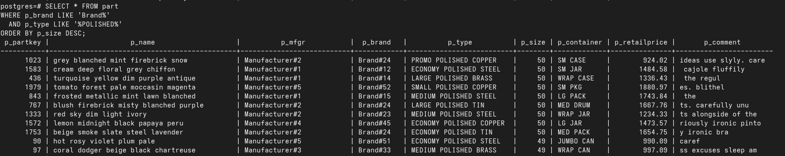

#### 1.2 统计 CUSTOMER 表中每个市场区域 (MKTSEGMENT) 的客户数量

```sql
SELECT c_mktsegment, COUNT(*) 
FROM customer 
GROUP BY c_mktsegment;
```

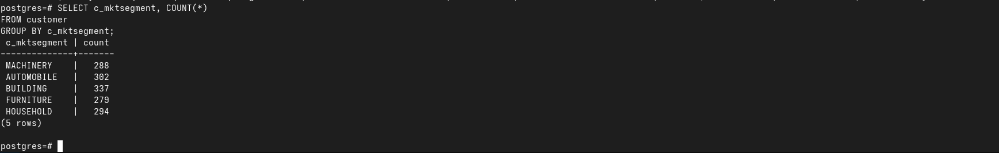

#### 1.3 查询 SUPPLIER 表中，账户余额 (ACCTBAL) 平均值大于 9000 的国家 (NATIONKEY) 及其平均余额

```sql
SELECT s_nationkey, AVG(s_acctbal) 
FROM supplier 
GROUP BY s_nationkey 
HAVING AVG(s_acctbal) > 9000;
```

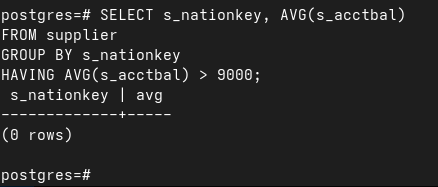

#### 1.4 查询 ORDERS 表中订单总金额 (TOTALPRICE) 最高的前 10 笔订单信息

```sql
SELECT * FROM orders 
ORDER BY o_totalprice DESC 
LIMIT 10;
```

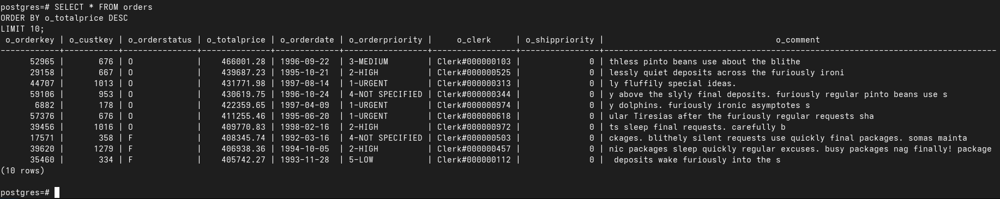

#### 1.5 查询 LINEITEM 表中每条订单明细的实际金额（扩展价格 × (1 - 折扣)），并显示订单号、商品号和实际金额

```sql
SELECT l_orderkey, l_partkey, l_extendedprice * (1 - l_discount) AS actual_price 
FROM lineitem;
```

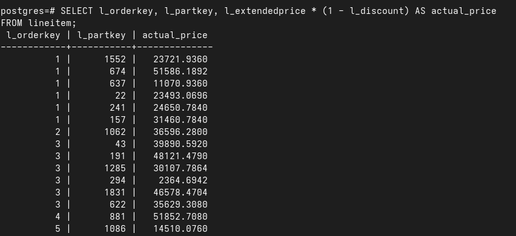

#### 1.6 统计 PART 表中包装类型 (CONTAINER) 以 "SM" 开头的各类包装的商品数量

```sql
SELECT p_container, COUNT(*) 
FROM part 
WHERE p_container LIKE 'SM%' 
GROUP BY p_container;
```

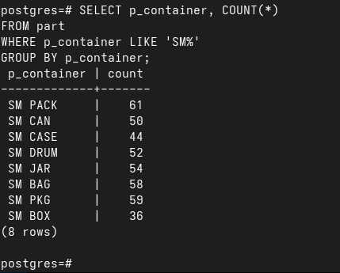

#### 1.7 查询 LINEITEM 表中，发货模式 (SHIPMODE) 为 "AIR" 或 "TRUCK"，且平均数量大于 25 的发货模式

```sql
SELECT l_shipmode 
FROM lineitem 
WHERE l_shipmode IN ('AIR', 'TRUCK') 
GROUP BY l_shipmode 
HAVING AVG(l_quantity) > 25;
```

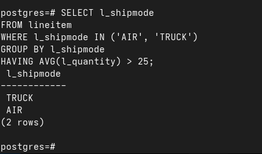

#### 1.8 查询 CUSTOMER 表，计算每个客户的折扣余额（账户余额 × 0.9），并按折扣余额降序排列

```sql
SELECT c_name, c_acctbal * 0.9 AS discount_balance 
FROM customer 
ORDER BY discount_balance DESC;
```

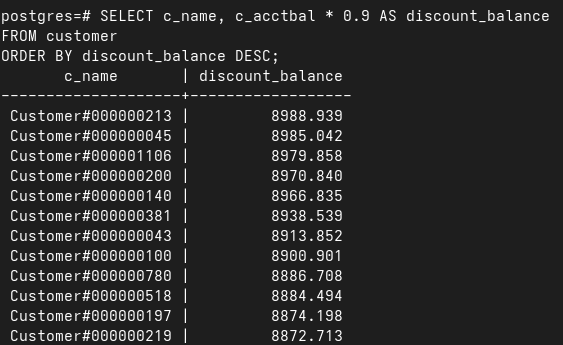

#### 1.9 查询 SUPPLIER 表中，电话号码以 "15" 开头的供应商，按国家分组后，筛选出供应商数量超过 5 个的国家

```sql
SELECT s_nationkey, COUNT(*) 
FROM supplier 
WHERE s_phone LIKE '15%' 
GROUP BY s_nationkey 
HAVING COUNT(*) > 5;
```

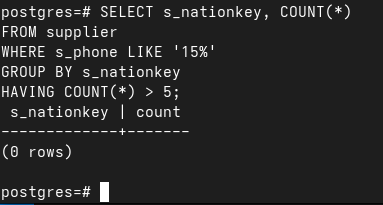

#### 1.10 查询 ORDERS 表中订单优先级 (PRIORITY) 包含 "URGENT" 的订单，按订单日期升序、总金额降序排列，显示前 15 条

```sql
SELECT * FROM orders 
WHERE o_orderpriority LIKE '%URGENT%' 
ORDER BY o_orderdate ASC, o_totalprice DESC 
LIMIT 15;
```

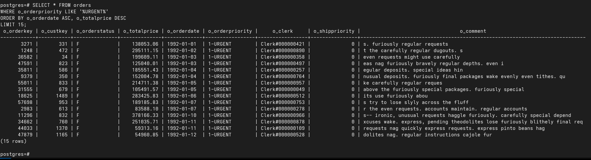

#### 1.11 查询 PART 表，找出品牌名称第二个字符为大写字母 "R"，且制造商名称以 "Manufacturer" 开头的商品，计算每个尺寸组的平均零售价

```sql
SELECT p_size, AVG(p_retailprice) 
FROM part 
WHERE SUBSTRING(p_brand, 2, 1) = 'R' 
  AND p_mfgr LIKE 'Manufacturer%' 
GROUP BY p_size;
```

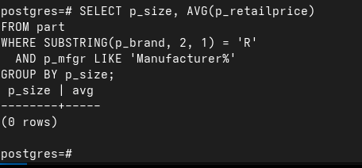

#### 1.12 查询 LINEITEM 表，统计 1995-1996 年间每个季度的订单明细数量，只显示数量超过 1000 的季度

```sql
SELECT EXTRACT(YEAR FROM l_shipdate) AS year, 
       EXTRACT(QUARTER FROM l_shipdate) AS quarter, 
       COUNT(*) 
FROM lineitem 
WHERE l_shipdate BETWEEN '1995-01-01' AND '1996-12-31' 
GROUP BY year, quarter 
HAVING COUNT(*) > 1000;
```

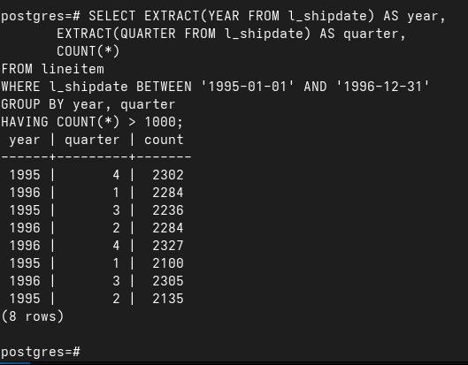

### 2. 多表查询

#### 2.1 查询每个国家 (NATION) 的客户数量，显示国家名称和客户数量

```sql
SELECT n.n_name, COUNT(c.c_custkey) 
FROM nation n 
JOIN customer c ON n.n_nationkey = c.c_nationkey 
GROUP BY n.n_name;
```

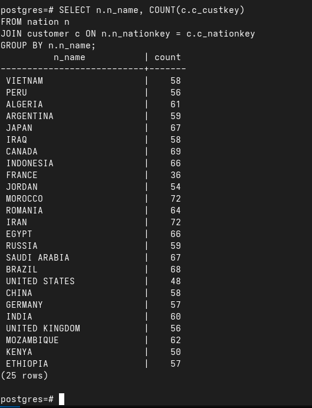

#### 2.2 查询每个地区 (REGION) 的供应商数量，显示地区名称和供应商数量

```sql
SELECT r.r_name, COUNT(s.s_suppkey) 
FROM region r 
JOIN nation n ON r.r_regionkey = n.n_regionkey 
JOIN supplier s ON n.n_nationkey = s.s_nationkey 
GROUP BY r.r_name;
```

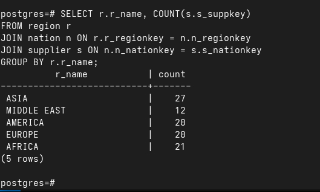

#### 2.3 查询单个订单总金额超过 10000 的客户名称及其订单总金额

```sql
SELECT c.c_name, o.o_totalprice 
FROM customer c 
JOIN orders o ON c.c_custkey = o.o_custkey 
WHERE o.o_totalprice > 10000;
```

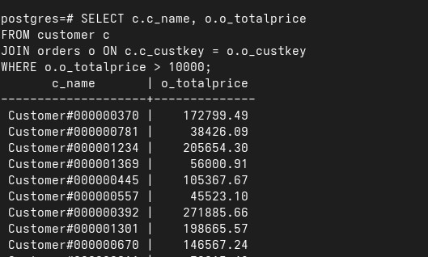

#### 2.4 查询至少有一个订单的客户信息

```sql
SELECT DISTINCT c.* FROM customer c 
JOIN orders o ON c.c_custkey = o.o_custkey;
```

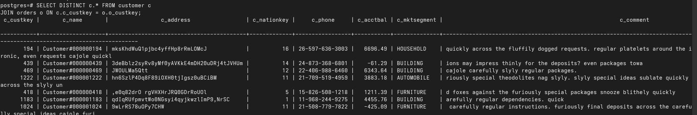

#### 2.5 查询每个国家的平均客户账户余额，结果显示国家名称和平均客户账户余额

```sql
SELECT n.n_name, AVG(c.c_acctbal) 
FROM nation n 
JOIN customer c ON n.n_nationkey = c.c_nationkey 
GROUP BY n.n_name;
```

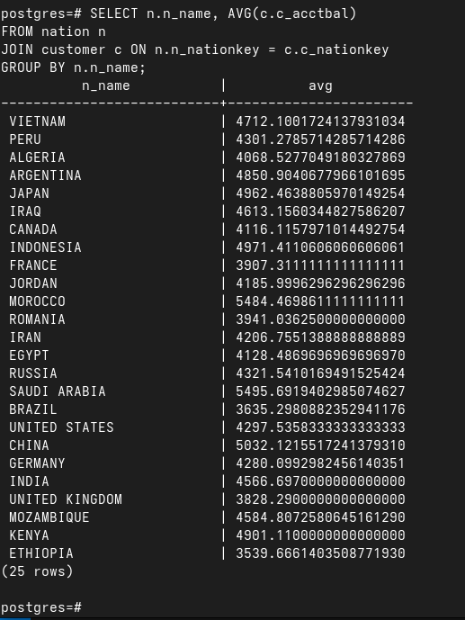

#### 2.6 查询没有下过任何订单的客户信息

```sql
SELECT c.* FROM customer c 
LEFT JOIN orders o ON c.c_custkey = o.o_custkey 
WHERE o.o_orderkey IS NULL;
```

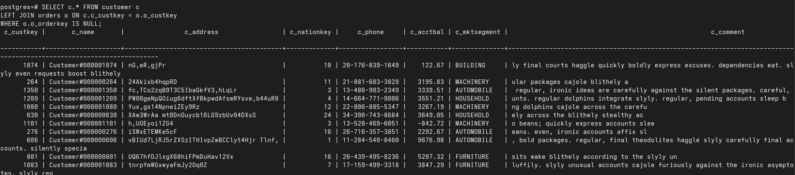

#### 2.7 查询在同一国家的客户对（不重复组合）

```sql
SELECT c1.c_name AS customer1, c2.c_name AS customer2, n.n_name 
FROM customer c1 
JOIN customer c2 ON c1.c_nationkey = c2.c_nationkey 
JOIN nation n ON c1.c_nationkey = n.n_nationkey 
WHERE c1.c_custkey < c2.c_custkey 
LIMIT 20; 
```

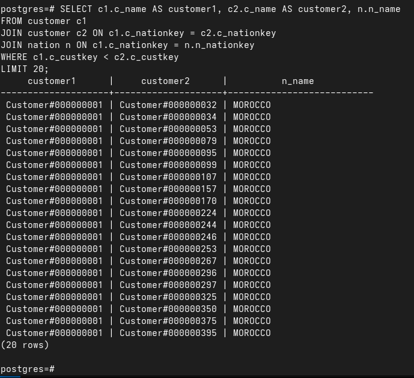

#### 2.8 查询订单总金额超过该客户平均订单金额的订单信息

```sql
SELECT o1.* FROM orders o1 
WHERE o1.o_totalprice > (
    SELECT AVG(o2.o_totalprice) 
    FROM orders o2 
    WHERE o2.o_custkey = o1.o_custkey
);
```

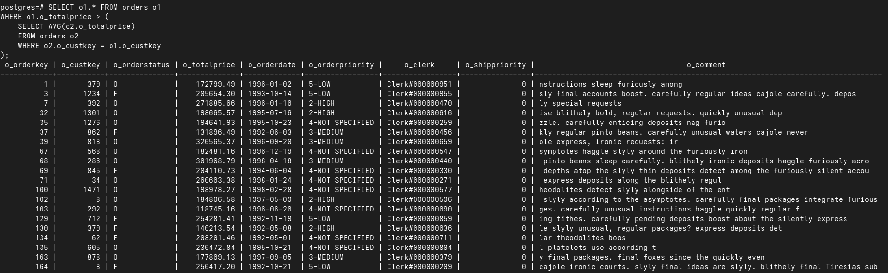

#### 2.9 查询供应了所有类型商品的供应商信息

```sql
SELECT s.* FROM supplier s 
WHERE NOT EXISTS (
    SELECT p.p_type 
    FROM part p 
    WHERE NOT EXISTS (
        SELECT 1 
        FROM partsupp ps 
        JOIN part p2 ON ps.ps_partkey = p2.p_partkey 
        WHERE ps.ps_suppkey = s.s_suppkey 
          AND p2.p_type = p.p_type
    )
);
```

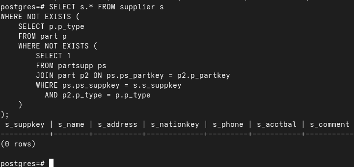

#### 2.10 查询总价大于所处月份平均总价的订单

```sql
SELECT o1.* FROM orders o1 
WHERE o1.o_totalprice > (
    SELECT AVG(o2.o_totalprice) 
    FROM orders o2 
    WHERE EXTRACT(YEAR FROM o2.o_orderdate) = EXTRACT(YEAR FROM o1.o_orderdate)
      AND EXTRACT(MONTH FROM o2.o_orderdate) = EXTRACT(MONTH FROM o1.o_orderdate)
);
```

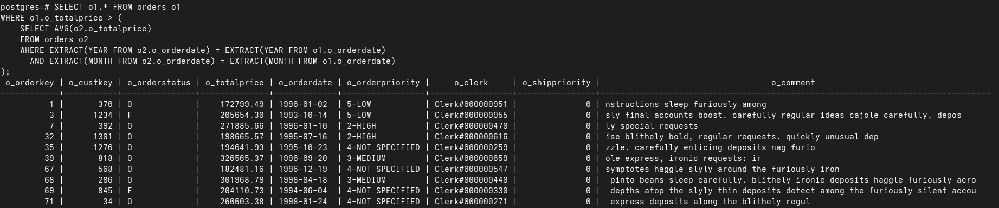
