# 数据库实验报告

李甘 2023202296

## 实验一 基于文件系统的商城库存管理系统

### 1. 实现方法

系统以CSV文件作为持久化介质，商品与进销记录分别存储于products.csv与records.csv；内存中加载为结构体列表，按需检索、排序与统计，商品删除采用逻辑删除。所有增删改查通过顺序读写与追加实现，并对时间与数量等输入做基本校验。

商品数据结构

| 字段 | 含义 | 示例 |
| --- | --- | --- |
| id | 商品编号（唯一） | P001 |
| name | 商品名称 | Apple |
| category | 商品类别 | Fruit |
| stock | 当前库存 | 120 |
| deleted | 逻辑删除标记 | false |

进销记录数据结构

| 字段 | 含义 | 示例 |
| --- | --- | --- |
| productId | 商品编号 | P001 |
| productName | 商品名称（冗余便于历史可读） | Apple |
| type | 记录类型（进货/销售） | Purchase |
| operatorName | 操作人 | Alice |
| timestamp | 时间（YYYY-MM-DD HH:MM:SS） | 2025-10-10 09:30:00 |
| quantity | 数量（正整数） | 50 |

### 2. 运行截图

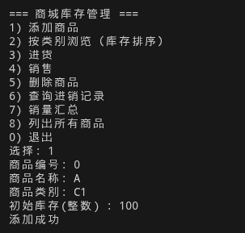

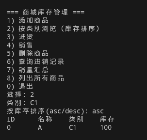

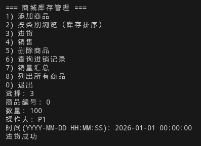

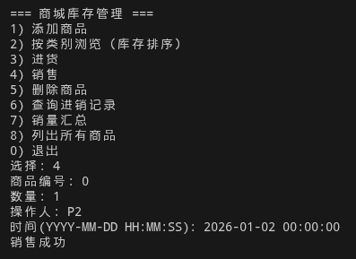

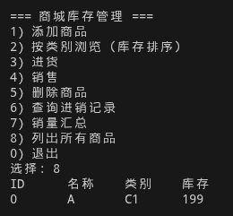

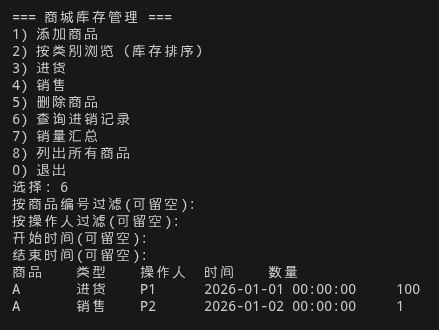

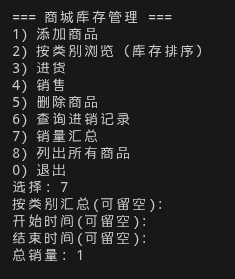

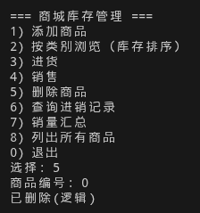

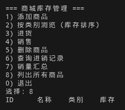

## 实验二 数据库系统的使用

我在我的安装有 Fedora Linux 的笔记本电脑上用 PostgreSQL 完成了下面的实验。

### 1. 安装并启动数据库

```bash
sudo dnf install postgresql-server postgresql-contrib
sudo /usr/bin/postgresql-setup --initdb
sudo systemctl status postgresql
sudo systemctl start postgresql
sudo -u postgres psql
```

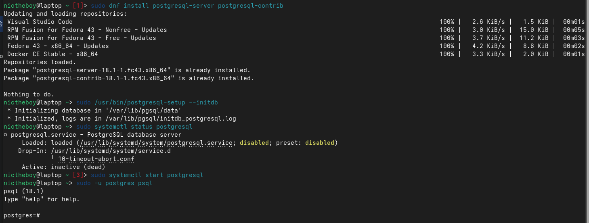

### 2. 创建表结构

```sql
CREATE TABLE nation  ( N_NATIONKEY  INTEGER NOT NULL,
N_NAME       CHAR(25) NOT NULL,
N_REGIONKEY  INTEGER NOT NULL,
N_COMMENT    VARCHAR(152));

CREATE TABLE region  ( R_REGIONKEY  INTEGER NOT NULL,
R_NAME       CHAR(25) NOT NULL,
R_COMMENT    VARCHAR(152));

CREATE TABLE part  ( P_PARTKEY     INTEGER NOT NULL,
P_NAME        VARCHAR(55) NOT NULL,
P_MFGR        CHAR(25) NOT NULL,
P_BRAND       CHAR(10) NOT NULL,
P_TYPE        VARCHAR(25) NOT NULL,
P_SIZE        INTEGER NOT NULL,
P_CONTAINER   CHAR(10) NOT NULL,
P_RETAILPRICE DECIMAL(15,2) NOT NULL,
P_COMMENT     VARCHAR(23) NOT NULL );

CREATE TABLE supplier ( S_SUPPKEY     INTEGER NOT NULL,
S_NAME        CHAR(25) NOT NULL,
S_ADDRESS     VARCHAR(40) NOT NULL,
S_NATIONKEY   INTEGER NOT NULL,
S_PHONE       CHAR(15) NOT NULL,
S_ACCTBAL     DECIMAL(15,2) NOT NULL,
S_COMMENT     VARCHAR(101) NOT NULL);

CREATE TABLE partsupp ( PS_PARTKEY     INTEGER NOT NULL,
PS_SUPPKEY     INTEGER NOT NULL,
PS_AVAILQTY    INTEGER NOT NULL,
PS_SUPPLYCOST  DECIMAL(15,2)  NOT NULL,
PS_COMMENT     VARCHAR(199) NOT NULL );

CREATE TABLE customer ( C_CUSTKEY     INTEGER NOT NULL,
C_NAME        VARCHAR(25) NOT NULL,
C_ADDRESS     VARCHAR(40) NOT NULL,
C_NATIONKEY   INTEGER NOT NULL,
C_PHONE       CHAR(15) NOT NULL,
C_ACCTBAL     DECIMAL(15,2)   NOT NULL,
C_MKTSEGMENT  CHAR(10) NOT NULL,
C_COMMENT     VARCHAR(117) NOT NULL);

CREATE TABLE orders  ( O_ORDERKEY       INTEGER NOT NULL,
O_CUSTKEY        INTEGER NOT NULL,
O_ORDERSTATUS    CHAR(1) NOT NULL,
O_TOTALPRICE     DECIMAL(15,2) NOT NULL,
O_ORDERDATE      DATE NOT NULL,
O_ORDERPRIORITY  CHAR(15) NOT NULL,
O_CLERK          CHAR(15) NOT NULL,
O_SHIPPRIORITY   INTEGER NOT NULL,
O_COMMENT        VARCHAR(79) NOT NULL);

CREATE TABLE lineitem ( L_ORDERKEY    INTEGER NOT NULL,
L_PARTKEY     INTEGER NOT NULL,
L_SUPPKEY     INTEGER NOT NULL,
L_LINENUMBER  INTEGER NOT NULL,
L_QUANTITY    DECIMAL(15,2) NOT NULL,
L_EXTENDEDPRICE  DECIMAL(15,2) NOT NULL,
L_DISCOUNT    DECIMAL(15,2) NOT NULL,
L_TAX         DECIMAL(15,2) NOT NULL,
L_RETURNFLAG  CHAR(1) NOT NULL,
L_LINESTATUS  CHAR(1) NOT NULL,
L_SHIPDATE    DATE NOT NULL,
L_COMMITDATE  DATE NOT NULL,
L_RECEIPTDATE DATE NOT NULL,
L_SHIPINSTRUCT CHAR(25) NOT NULL,
L_SHIPMODE     CHAR(10) NOT NULL,
L_COMMENT      VARCHAR(44) NOT NULL);
```

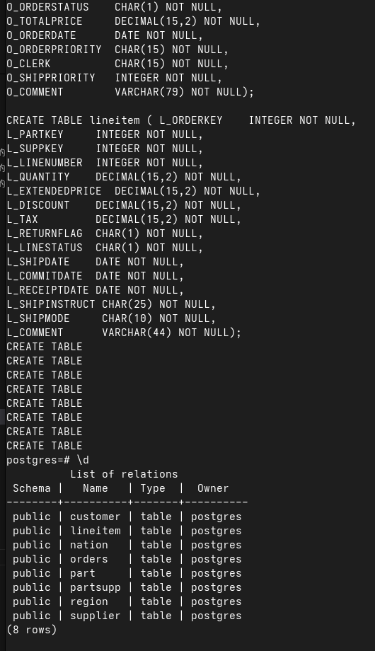

### 3. 添加主键和外键

```sql
-- 1. REGION 表
ALTER TABLE REGION ADD PRIMARY KEY (R_REGIONKEY);

-- 2. NATION 表
ALTER TABLE NATION ADD PRIMARY KEY (N_NATIONKEY);
ALTER TABLE NATION ADD FOREIGN KEY (N_REGIONKEY) REFERENCES REGION(R_REGIONKEY);

-- 3. PART 表
ALTER TABLE PART ADD PRIMARY KEY (P_PARTKEY);

-- 4. SUPPLIER 表
ALTER TABLE SUPPLIER ADD PRIMARY KEY (S_SUPPKEY);
ALTER TABLE SUPPLIER ADD FOREIGN KEY (S_NATIONKEY) REFERENCES NATION(N_NATIONKEY);

-- 5. PARTSUPP 表
ALTER TABLE PARTSUPP ADD PRIMARY KEY (PS_PARTKEY, PS_SUPPKEY);
ALTER TABLE PARTSUPP ADD FOREIGN KEY (PS_PARTKEY) REFERENCES PART(P_PARTKEY);
ALTER TABLE PARTSUPP ADD FOREIGN KEY (PS_SUPPKEY) REFERENCES SUPPLIER(S_SUPPKEY);

-- 6. CUSTOMER 表
ALTER TABLE CUSTOMER ADD PRIMARY KEY (C_CUSTKEY);
ALTER TABLE CUSTOMER ADD FOREIGN KEY (C_NATIONKEY) REFERENCES NATION(N_NATIONKEY);

-- 7. ORDERS 表
ALTER TABLE ORDERS ADD PRIMARY KEY (O_ORDERKEY);
ALTER TABLE ORDERS ADD FOREIGN KEY (O_CUSTKEY) REFERENCES CUSTOMER(C_CUSTKEY);

-- 8. LINEITEM 表
ALTER TABLE LINEITEM ADD PRIMARY KEY (L_ORDERKEY, L_LINENUMBER);
ALTER TABLE LINEITEM ADD FOREIGN KEY (L_ORDERKEY) REFERENCES ORDERS(O_ORDERKEY);
ALTER TABLE LINEITEM ADD FOREIGN KEY (L_PARTKEY, L_SUPPKEY) REFERENCES PARTSUPP(PS_PARTKEY, PS_SUPPKEY);
```

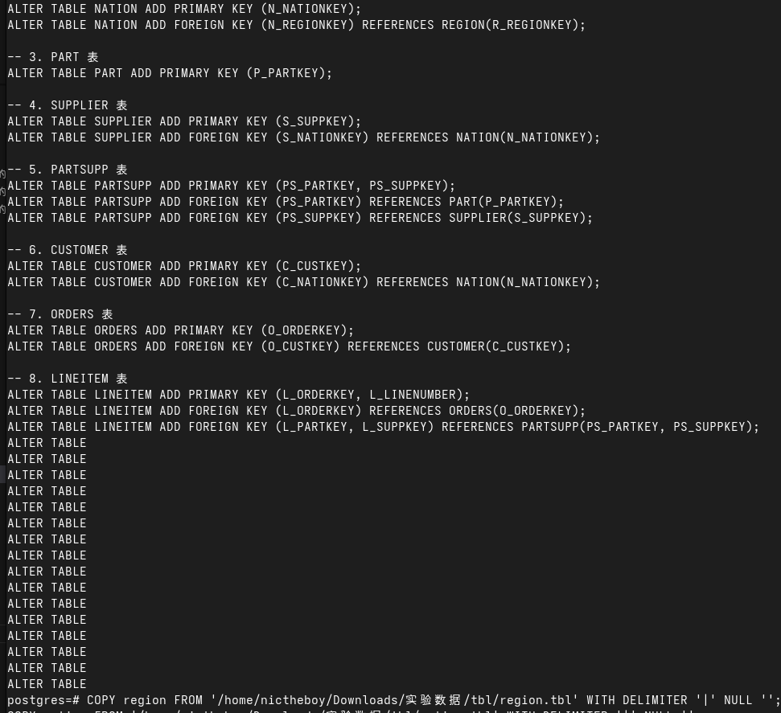

### 4. 导入数据

先把数据文件末尾的 | 去掉：

```bash
sed -i 's/|$//' *.tbl
```

然后导入数据：

```sql
COPY region FROM '/tmp/data/region.tbl' WITH DELIMITER '|' NULL '';
COPY nation FROM '/tmp/data/nation.tbl' WITH DELIMITER '|' NULL '';
COPY part FROM '/tmp/data/part.tbl' WITH DELIMITER '|' NULL '';
COPY supplier FROM '/tmp/data/supplier.tbl' WITH DELIMITER '|' NULL '';
COPY customer FROM '/tmp/data/customer.tbl' WITH DELIMITER '|' NULL '';
COPY partsupp FROM '/tmp/data/partsupp.tbl' WITH DELIMITER '|' NULL '';
COPY orders FROM '/tmp/data/orders.tbl' WITH DELIMITER '|' NULL '';
COPY lineitem FROM '/tmp/data/lineitem.tbl' WITH DELIMITER '|' NULL '';
```

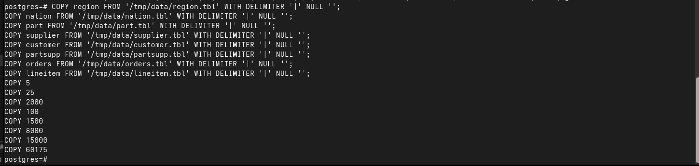

### 5. 验证和查询

```sql
SELECT count(*) FROM customer; 
SELECT count(*) FROM orders;
SELECT count(*) FROM lineitem;

-- 查询余额最高的前5个消费者
SELECT c_name, c_acctbal FROM customer ORDER BY c_acctbal DESC LIMIT 5;

-- 带 Join 的查询：查询每个国家的供应商数量
SELECT n.n_name, count(*) 
FROM supplier s 
JOIN nation n ON s.s_nationkey = n.n_nationkey 
GROUP BY n.n_name;
```

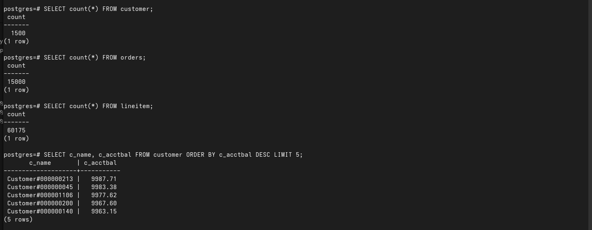

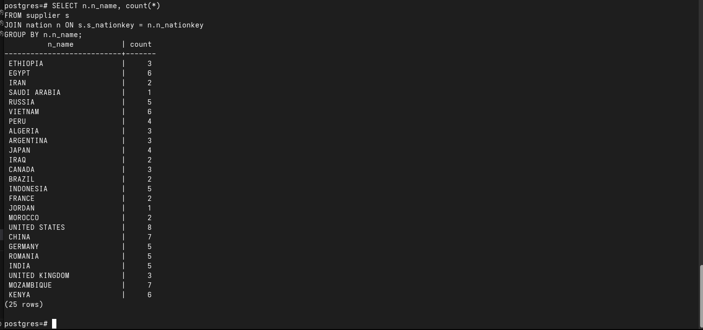
